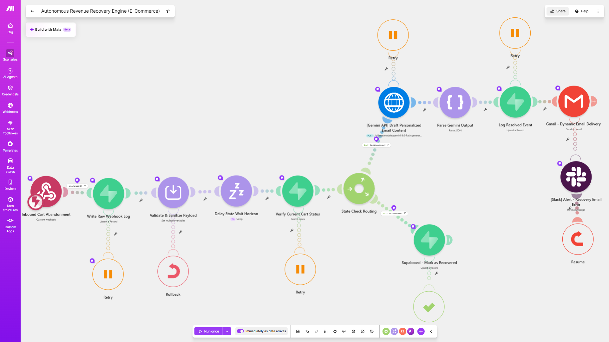
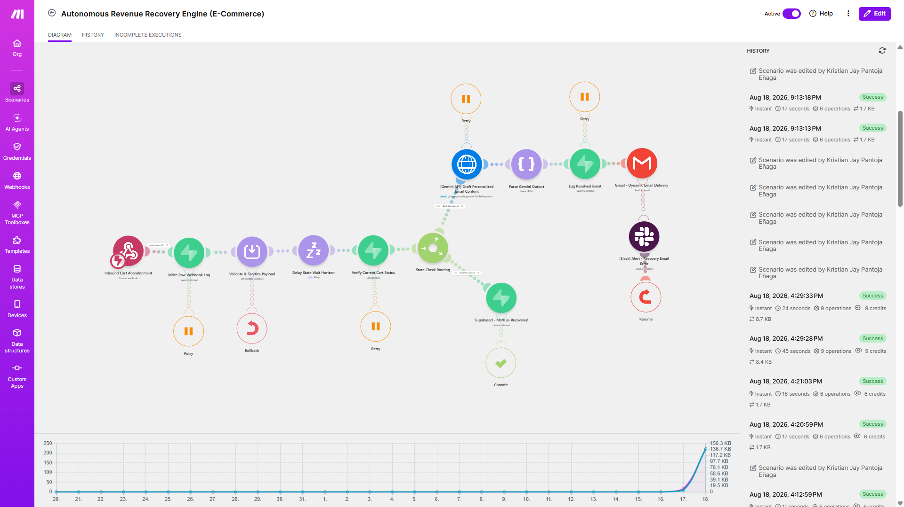
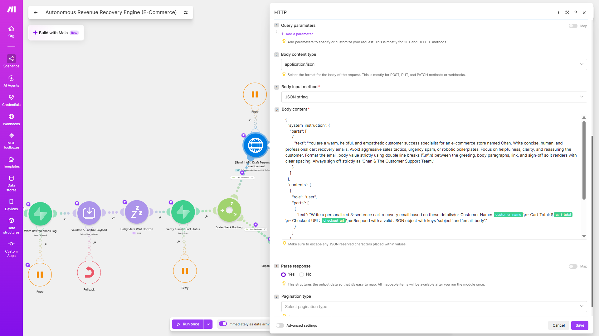

# ⚡ Autonomous Revenue Recovery & Cart Abandonment Engine

An enterprise-grade, stateful e-commerce revenue recovery system built in Make.com. Features deterministic schema validation, AI email personalization via Gemini API, state delay handling, and automated error logging.

*Figure 1: Complete stateful workflow execution path in Make.com.*

---

## 🎯 Business Problem
E-commerce brands lose up to **70% of abandoned carts** due to generic, ill-timed follow-up sequences and fragile linear automations. Unhandled API rate limits, duplicate webhook events, and lack of dynamic state checks result in burnt domain reputations, high unsubscribes, and tens of thousands of dollars in unrecovered revenue.

---

## 🚀 Solution Overview
This production-grade Make.com engine acts as an intelligent, self-healing revenue recovery gatekeeper:

1. **Deterministic Ingestion & Defensive Gates:** Validates customer checkout webhooks against strict schemas before executing any CRM or database writes.
2. **Stateful Delay & Dynamic Evaluation:** Holds workflow execution to allow real-time customer purchase checks before firing recovery campaigns, eliminating redundant emails.
3. **Gemini AI Personalization Engine:** Leverages Google Gemini API with dynamic prompt injection (cart items, cart value, customer history) to generate hyper-personalized recovery pitches.
4. **Resilient Infrastructure:** Implements automatic retries, rate-limit management (HTTP 429 handling), and dead-letter queue routing for complete error isolation.

---

## 💰 Business Impact & ROI
* **📈 Higher Recovered Revenue:** Dynamic AI personalization and stateful delay handling dramatically boost recovery email click-through rates compared to static templates.
* **🛡️ Zero Data Loss Guarantee:** Defensive schema validation prevents corrupted or incomplete checkout payloads from writing to downstream analytics platforms.
* **⚙️ Zero-Maintenance Reliability:** Built-in fail-safes handle API timeouts and network hiccups automatically without engineering intervention.

---

## 🧪 Live Execution Proof & Payload Verification

### 1. Verified Execution Logs

*Figure 2: Make.com execution history confirming 100% successful state processing and workflow completion.*

### 2. Structured AI Output & Prompt Architecture

*Figure 3: Structured Gemini API request payload showing system instructions, cart context, and prompt variables.*

---

## 🛠️ Tech Stack & Integrations
* **Orchestration Platform:** Make.com (Enterprise Architecture Standard)
* **AI Engine:** Google Gemini API (Structured Prompts & System Instructions)
* **API Standards:** REST HTTP, Dynamic Webhooks, Custom Exception Handling
* **Data Integrity:** Schema Validation & Stateful Memory Handling

---

## ⚙️ How to Import
1. Download the `_Autonomous Revenue Recovery Engine (E-Commerce).blueprint.json` file from this repository.
2. In Make.com, create a new scenario → **Import Blueprint**.
3. Configure your `GEMINI_API_KEY` credential variable.
4. Link your dynamic webhook URL to your e-commerce checkout platform (Shopify, WooCommerce, or custom API).

---

## 📈 Engineering Roadmap & Milestone
* **Roadmap Phase:** Phase 2 (Automation Engineering)
* **Sprint Tracker:** Sprint 4 — AI Integration, API Keys & Structured AI Outputs
* **Build Milestone:** Completed (Day 62/153)
